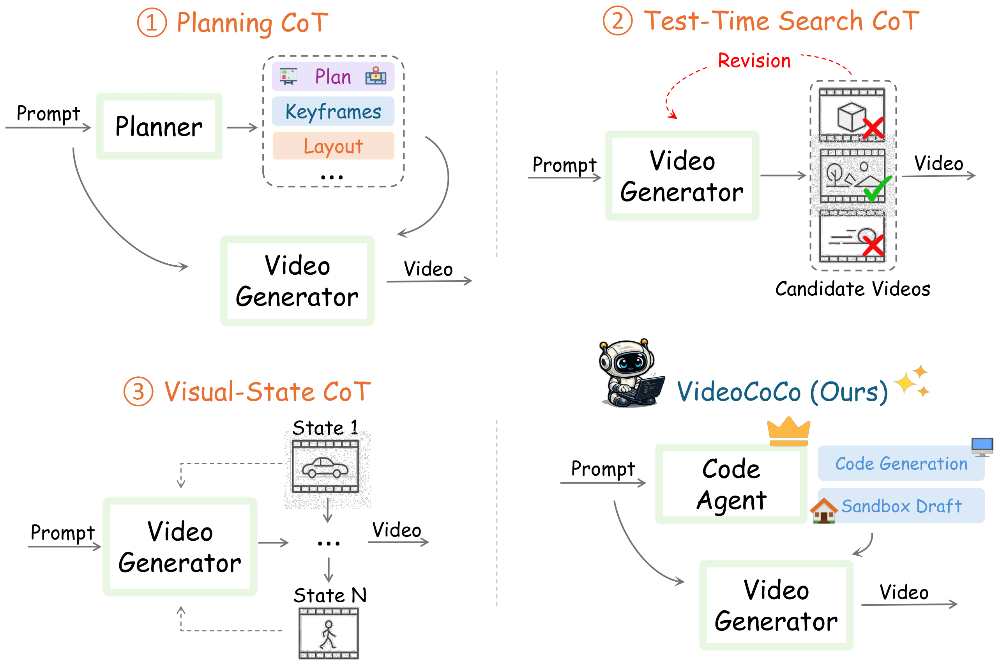
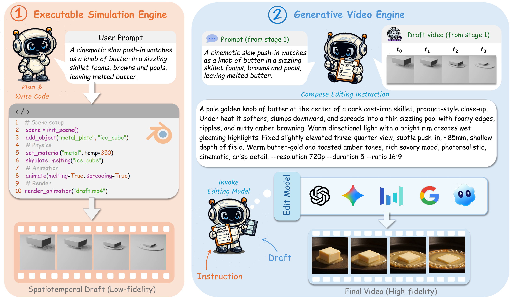

# 🎬 VideoCoCo: Code as CoT for Physics-Faithful Video Generation

Official repository for **VideoCoCo**, a physics-faithful video generation
pipeline that uses **code as a chain-of-thought** to draft physics before
committing to pixels.

[[🤗 Weights](https://huggingface.co/mickyhimself/VideoCoCo)] [[💻 Code](https://github.com/micky-li-hd/VideoCoCo)]

<p align="center"></p>

## 💥 News
- **[2026.07.29]** We release the Agent Skills, a toy dataset, and the inference code. Tuned weights are uploading to the [🤗 Hub](https://huggingface.co/mickyhimself/VideoCoCo).

## 🪄 Draft Before Generation

We propose **VideoCoCo**, an interleaved reasoning paradigm that carries a
physical prior through an explicit visual draft before committing to pixels.

Our method 🎨 **first has a code agent write simulation code and render it in a
sandbox as a neutral white/clay _proxy_ video** that carries the correct motion,
causality, and physics — meaning is expressed by shape, transparency,
deformation, and coverage, never by color.

Then we 🔎 **verify the proxy against the physical plan** (a caused state must
stay hidden until its causing transition), and 🖼️ **restyle the proxy into a
photorealistic video** driven by a per-case edit instruction.

<p align="center"></p>

## 📦 What's in this repo

- **`skill/`** — the five Agent Skills forming the pipeline: `physical-state-planner`
  → `physical-video-blender-implementer` → `blender-mcp-video` →
  `seedance-edit-prompt` → `seedance-distill`.
- **`data/toy_cases/`** — 8 hand-checked video-to-video (v2v) triplets.
- **`inference/`** — batch inference scripts + a patch against upstream OmniWeaving.
- **🤗 [`mickyhimself/VideoCoCo`](https://huggingface.co/mickyhimself/VideoCoCo)** — the tuned transformer.

## 🎬 Toy dataset

`data/toy_cases/` — 8 v2v triplets, one directory per case:

```
data/toy_cases/
├── manifest.jsonl                 # one JSON line per case (index)
├── 0000_buoyancy/
│   ├── video.mp4                  # source: neutral white/clay physics proxy
│   ├── seedance.mp4               # target: photoreal restyle
│   └── edit_prompt.txt            # instruction used to restyle proxy -> photoreal
└── ...
```

Each `manifest.jsonl` line:

```json
{"case_id": "0000_buoyancy", "source": "0000_buoyancy/video.mp4", "target": "0000_buoyancy/seedance.mp4", "instruction": "...", "category": "buoyancy"}
```

- **source** (`video.mp4`) — a grayscale/white-material render. Physical meaning
  is carried by shape, motion, transparency, deformation, and coverage, not color.
- **target** (`seedance.mp4`) — the photorealistic result.
- **instruction** (`edit_prompt.txt`) — the English restyle prompt mapping source
  motion to the photoreal target.

The 8 cases cover buoyancy, stress/deformation, melting (×2), surface tension,
sublimation, elasticity, and boiling — a *toy* sample for format inspection, not
a training-scale corpus.

## ⚙️ Inference

See [`inference/README.md`](inference/README.md): clone the official
[OmniWeaving](https://github.com/Tencent-Hunyuan/OmniWeaving), apply our patch,
pull the tuned weights from the 🤗 Hub, and run `bench_infer/batch_infer_edit.py`.

## 🗺️ Roadmap

- [x] Agent Skills (`skill/` — prompt → physical plan → Blender proxy → photoreal edit prompt)
- [x] Toy dataset (8 v2v triplets)
- [x] Inference stack (`inference/` — scripts + upstream patch)
- [ ] Tuned weights (uploading to [🤗 Hugging Face Hub](https://huggingface.co/mickyhimself/VideoCoCo))

## 🧠 Our Related Work

Explore our additional research on **Text-to-Image / Video Generation** and **CoT Reasoning**:

- **[CoCo]** [CoCo: Code as CoT for Text-to-Image Preview and Rare Concept Generation](https://arxiv.org/abs/2603.08652) · [model](https://huggingface.co/mickyhimself/CoCo)
- **[DraCo]** [DraCo: Draft as CoT for Text-to-Image Preview and Rare Concept Generation](https://arxiv.org/abs/2512.05112) · [code](https://github.com/CaraJ7/DraCo)
- **[T2I-R1]** [T2I-R1: Reinforcing Image Generation with Collaborative Semantic-level and Token-level CoT](https://arxiv.org/abs/2505.00703) · [code](https://github.com/CaraJ7/T2I-R1)
- **[Image Generation CoT]** [Can We Generate Images with CoT? Let's Verify and Reinforce Image Generation Step by Step](https://arxiv.org/abs/2501.13926) · [code](https://github.com/ZiyuGuo99/Image-Generation-CoT)
- **[NextStep-1]** [NextStep-1: Toward Autoregressive Image Generation with Continuous Tokens at Scale](https://arxiv.org/abs/2508.10711) · [code](https://github.com/stepfun-ai/NextStep-1)
- **[LongCat-Next]** [LongCat-Next](https://github.com/meituan-longcat/LongCat-Next) · [model](https://huggingface.co/meituan-longcat/LongCat-Next)

## 📄 License

Dataset released for research use. The inference code and tuned weights build on
**Tencent HY-OmniWeaving** and are governed by the Tencent HY Community License
Agreement; those components ship with the corresponding license and attribution.
